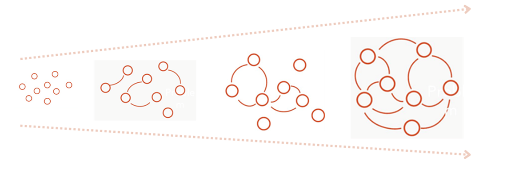

En esta página se busca construir **ecosistemas colaborativos** para la Antropología Forense. Esta perspectiva parte de reconocer que no existen soluciones simples y de que ningún ningún individuo u organización pueden obtener los resultados desados si trabajan de manera aislada. En lugar de preguntarnos ¿cuál es la solución a la crisis forense?, nos enfocamos en **¿cómo facilitar interacciones que fortalezcan las conexiones entre actores e instituciones que conduzcan a resultados colectivos más exitosos?**

Para esto es necesario ir más allá de la cooperación, y buscar soluciones flexibles basadas en la escucha mutua y el aprendizaje compartido. La colaboración, entendida así, se convierte en un proceso de creación conjunta en el que se comparten saberes y recursos en busca de un objetivo común. 

En esta página encontrarás materiales y recursos útiles que buscan contribuir a esta construcción colaborativa en el ámbito de la antropología forense. 

### Diseño web
**Arodi Farrera.** Instituto de Investigaciones Antropológicas, Universidad Nacional Autónoma de México. 

**Caleb Rascón.** Instituto de Investigaciones en Matemáticas Aplicadas y en Sistemas, Universidad Nacional Autónoma de México. 
